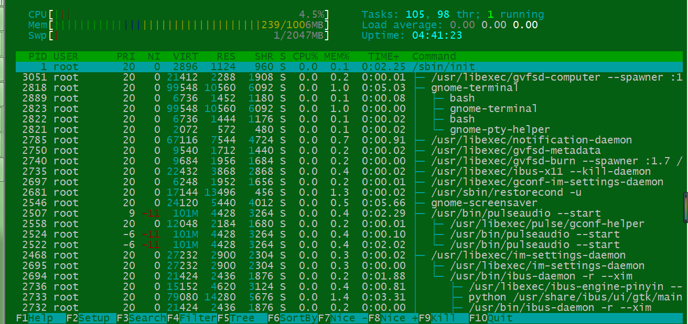

linux下安装htop
===============

下载源文件
----------

htop-1.0.2.tar.gz下载地址：http://pan.baidu.com/s/1o6itGt8

安装依赖
--------

htop需要依赖ncurses，所以在安装之前先安装依赖包ncurses::

    yum install ncurses-devel

安装htop
--------
解压::

    tar -zxvf htop-1.0.2

切换目录::

    cd htop-1.0.2

安装::

    ./configure
    make
    make install

执行htop命令查看是否安装成功。 |htop|

